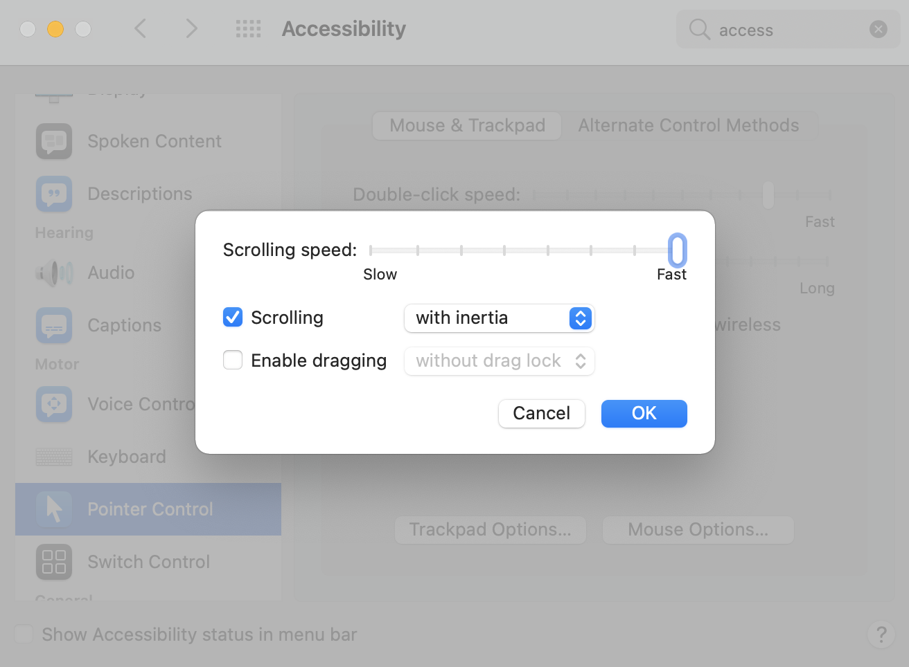

* make itunes song notifications appear instantly: https://apple.stackexchange.com/a/315055
* key repeat. System Preferences > Keyboard: https://dl.dropboxusercontent.com/s%2Fzi77vkempn0l5a8%2F2019-05-12_14-11-07.png
* allow tab / spacebar selection of buttons in system dialogs: https://superuser.com/a/473145 
* scroll speed
* 
* trackpad
  * Point & click > Tap to click: enable
  * Scroll & zoom > Natural scrolling: disable
  * Gestures > Swipe between pages: off
  * Gestures > Mission control: off
  * Gestures > Launchpad: disable
  * Gestures > Show desktop: disable
* Finder
  * Show hidden files / folders: `Command + Shift + .` Permanently enable: https://apple.stackexchange.com/a/302976
  * Settings > Sidebar > Don't show Recents in sidebar
  * Settings > Sidebar > Show homedir in sidebar
  * Settings > General > New finder windows show: homedir
  * Settings > Advanced > Show all filename extensions
  * Settings > Advanced > When performing a search: Search the current folder
  * View > Show sidebar
  * View > Show path bar
  * View > Show status bar
  * View > Show view options > enable:
    * Always open in list view
    * Browse in list view
    * Show columns: Date modified, Date created, Date added, Size, Kind
    * Use as defaults
* Desktop & dock
  * Automatically hide and show dock: enable
  * Hot corners > Top left: Start screen saver; Bottom left: Disable screen saver
